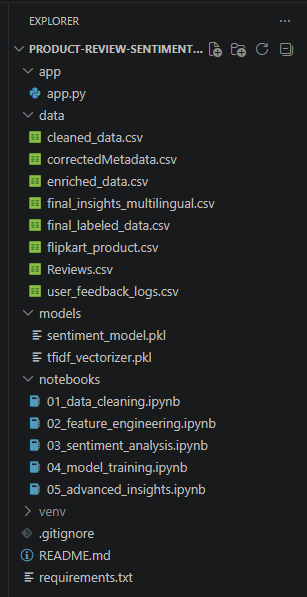

# 🏛️ Product Review Sentiment & Intent Analysis

A Machine Learning + NLP based multilingual dashboard that analyzes customer reviews, predicts sentiment, detects business intent, and provides strategic insights using an interactive Streamlit interface.

---

# 📌 Project Overview

This project helps businesses understand customer opinions from product reviews using:

- Sentiment Analysis (Positive / Negative / Neutral)
- Intent Detection
- Language Detection
- Emoji Emotion Analysis
- Fake Review Analysis
- Real-time AI Prediction
- Cloud Review Logging using Google Sheets
- Interactive BI Dashboard

The system supports multilingual and mixed-language reviews including:
- English
- Hindi
- Marathi
- Hinglish / Mixed Language

---

# 🚀 Features

## ✅ Real-Time AI Predictor
- Predicts customer sentiment instantly
- Detects review intent
- Supports multilingual reviews
- Voice input using microphone

## ✅ Language Detection
Detects:
- English
- Hindi
- Marathi
- Mixed Languages

## ✅ Intent Analysis
Detects customer intent such as:
- Pricing
- Logistics
- Quality
- Support
- General Feedback

## ✅ Integrity & Emotion Analysis
- Fake review detection
- Emoji emotion insights
- Sentiment intensity analysis

## ✅ Deep Dive Explorer
- Advanced filtering
- Language-wise analysis
- Sentiment-wise exploration

## ✅ Live Cloud Logging
Stores all user reviews and predictions in:
- Google Sheets Cloud Database

## ✅ Strategic Insights
Business pain-point analysis using customer feedback.

---

# 🛠️ Technologies Used

| Technology | Purpose |
|---|---|
| Python | Core Programming |
| Streamlit | Web Dashboard |
| Scikit-learn | ML Model |
| TF-IDF | Text Vectorization |
| Pandas | Data Handling |
| Matplotlib | Visualization |
| Seaborn | Heatmaps |
| Plotly | Interactive Charts |
| Langdetect | Language Detection |
| Joblib | Model Loading |
| Google Sheets API | Cloud Database |
| Streamlit Mic Recorder | Voice Input |

---

# 📂 Project Structure

```text
Product-Review-Sentiment-Analysis/
│
├── app/
│   └── app.py
│
├── data/
│   ├── final_insights_multilingual.csv
│   └── correctedMetadata.csv
│
├── models/
│   ├── sentiment_model.pkl
│   └── tfidf_vectorizer.pkl
│
├── requirements.txt
├── README.md
└── .gitignore
```

---

# ☁️ Live Google Sheet Database

All real-time user reviews and predictions are stored in a cloud Google Sheet using Google Apps Script API.

## 🔗 View Stored Reviews

Google Sheet Link:  
https://docs.google.com/spreadsheets/d/1wts27e8aBcAjq91u6is7jP11Q95rmXuyOoW0i4Tu9fI/edit?usp=sharing

Users can open this sheet to verify:
- Reviews are being stored successfully
- Sentiment predictions
- Intent detection results
- Language detection logs
- Prediction timestamps

---

## 📌 Stored Fields

| Field | Description |
|---|---|
| Timestamp | Date & Time of Prediction |
| Review | User Input Review |
| Sentiment | Positive / Negative / Neutral |
| Intent | Pricing / Quality / Logistics / Support |
| Language | Detected Language |

---

# 📊 Dashboard Tabs

| Tab | Description |
|---|---|
| 📈 Market Performance | Sentiment trends & heatmaps |
| 🤖 AI Predictor | Real-time sentiment prediction |
| 🕵️ Integrity & Emotions | Fake review & emoji analysis |
| 🎯 Advanced Filters | Deep Dive Explorer & live logs |
| 💡 Strategic Insights | Business pain-point analysis |

---

# 🎤 Voice Input Support

Users can:
- Speak reviews using microphone
- Convert speech to text
- Predict sentiment instantly

---

# 📈 Machine Learning Workflow

```text
User Review
    ↓
Text Cleaning
    ↓
TF-IDF Vectorization
    ↓
ML Sentiment Model
    ↓
Prediction
    ↓
Intent + Language Detection
    ↓
Dashboard Visualization
```

---

# 📌 Future Enhancements

- Deep Learning Models (LSTM/BERT)
- Real-time Translation
- Authentication System
- Deployment on AWS/Render
- Advanced Analytics
- Recommendation Engine


